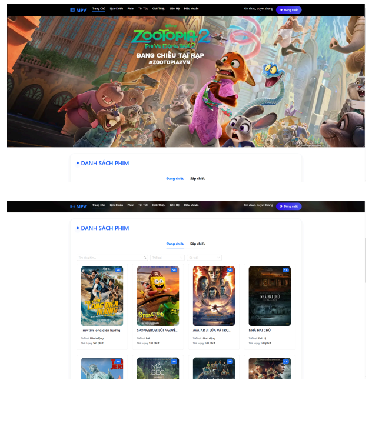

# 🎬 Movie Ticket Booking Web Application

## 📌 Giới thiệu

Đây là dự án Web Đặt Vé Xem Phim được xây dựng theo mô hình Full-stack sử dụng MERN Stack (MongoDB, ExpressJS, ReactJS, NodeJS).

Hệ thống cho phép người dùng xem thông tin phim, chọn suất chiếu, chọn ghế và đặt vé trực tuyến. Ngoài ra, hệ thống có trang quản trị dành cho Admin để quản lý phim, suất chiếu, người dùng và thống kê doanh thu.

---

## 🚀 Công nghệ sử dụng

### Frontend
- ReactJS
- React Router
- Axios
- CSS / SCSS
- React Hooks

### Backend
- NodeJS
- ExpressJS
- RESTful API

### Database
- MongoDB
- Mongoose

### Authentication & Security
- JWT (JSON Web Token)
- bcrypt (mã hóa mật khẩu)
- Role-based Authorization (Admin / User)

### Deployment
- Frontend: Vercel
- Backend: Render
- Database: MongoDB Atlas

---

## 🎯 Chức năng chính

### 👤 Người dùng
- Đăng ký / Đăng nhập tài khoản
- Xem danh sách phim đang chiếu
- Xem chi tiết phim
- Chọn suất chiếu theo ngày và giờ
- Chọn ghế ngồi
- Đặt vé và tính tổng tiền
- Xem lịch sử đặt vé

### 🛠 Quản trị viên (Admin)
- CRUD phim
- CRUD suất chiếu
- Quản lý người dùng
- Quản lý vé đã đặt
- Thống kê doanh thu

---

## 🏗 Kiến trúc hệ thống

- Frontend và Backend tách biệt
- Backend xây dựng theo mô hình MVC
- Giao tiếp giữa Frontend và Backend thông qua RESTful API
- Dữ liệu được lưu trữ trên MongoDB Atlas

---

## 💡 Điểm nổi bật

- Xây dựng hệ thống Full-stack hoàn chỉnh
- Triển khai xác thực và phân quyền người dùng
- Thiết kế giao diện theo hướng Component-based
- Xử lý logic chọn ghế và kiểm tra ghế đã đặt
- Tổ chức cấu trúc dự án rõ ràng, dễ mở rộng

---

## 📷 Hình ảnh minh họa

